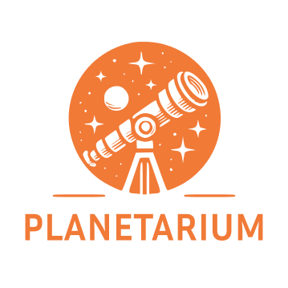
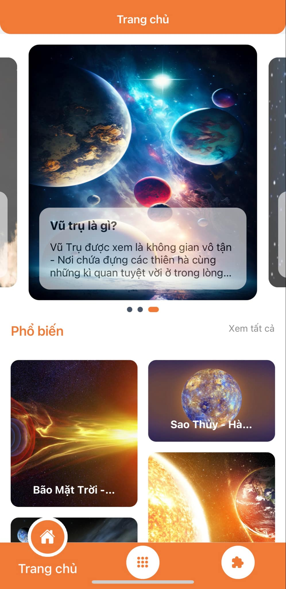
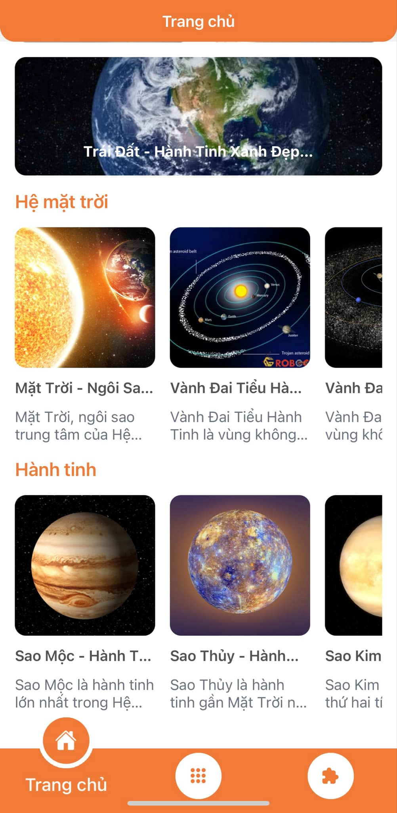
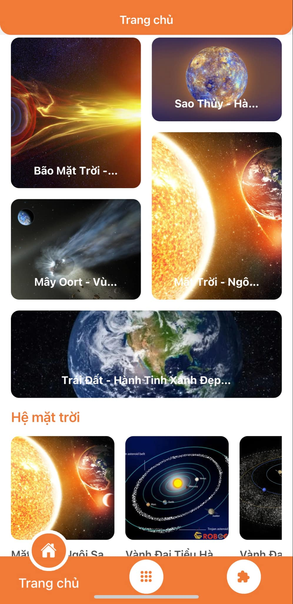
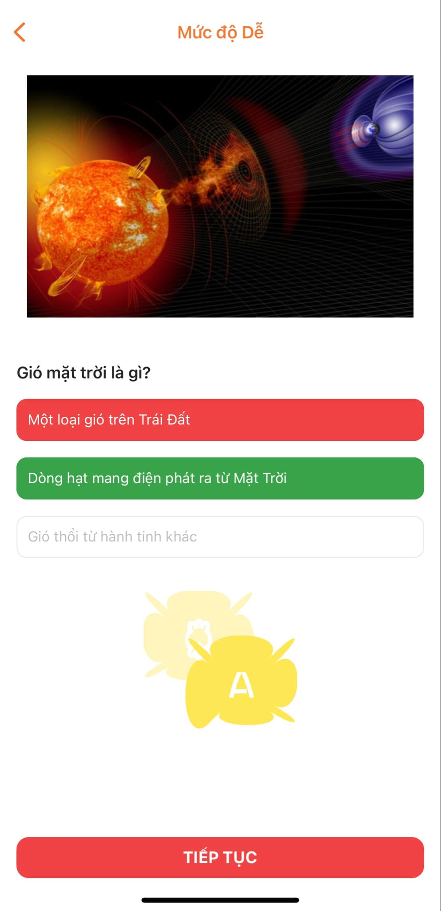
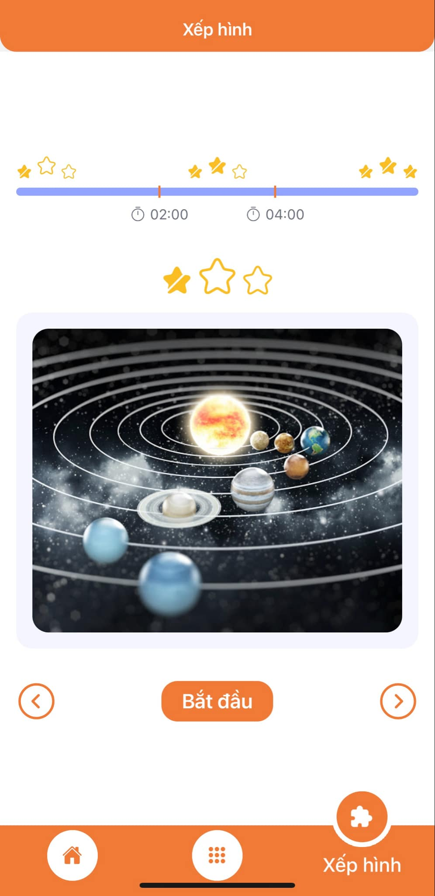
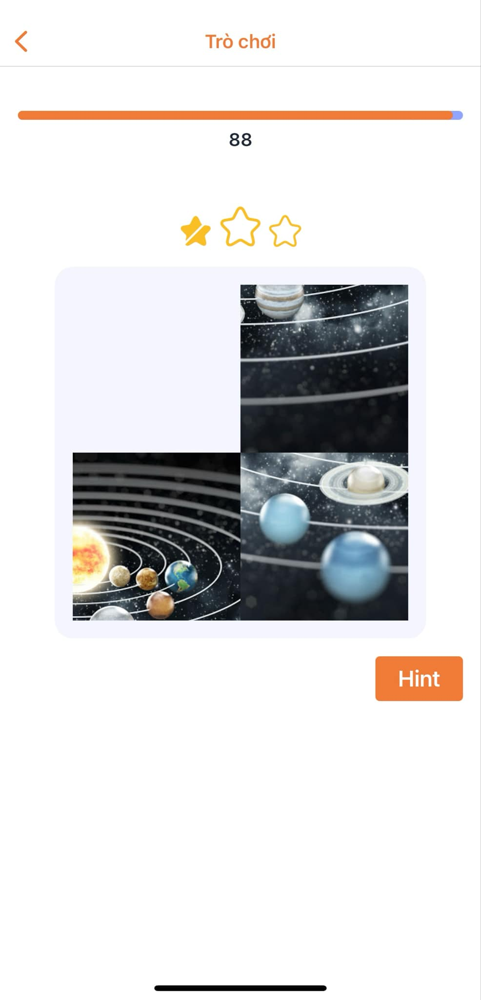
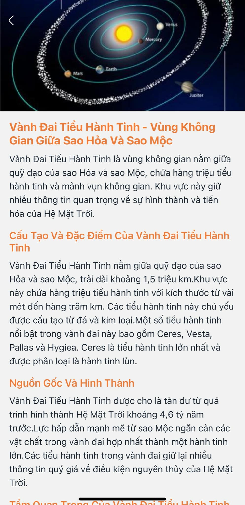

# Logo




## Table of Contents

- [Logo](#logo)
  - [Table of Contents](#table-of-contents)
  - [About](#about)
  - [Features](#features)
      - [Planet Information](#planet-information)
      - [Astronomy Quiz](#astronomy-quiz)
      - [Image Puzzle Game](#image-puzzle-game)
  - [Screenshots](#screenshots)
  - [Getting Started](#getting-started)
    - [Prerequisites](#prerequisites)
    - [Installation](#installation)

## About

A comprehensive astronomy app that helps users explore the universe in an engaging and effective way. Here are some key features of the app.

## Features

#### Planet Information

Each planet is fully described with information such as size, structure, atmospheric composition, and many other distinctive properties.

High-quality images and videos help users explore the beauty of each planet.

#### Astronomy Quiz

A variety of quiz functions with questions about planets, stars, and cosmic phenomena.

Assess users' knowledge through random or topic-based tests.

#### Image Puzzle Game

Creative image puzzle game to reinforce the user's mental image of the universe.

Offers increasingly difficult challenges to promote focus and problem-solving skills.

## Screenshots













## Getting Started

### Prerequisites

- Node.Js: https://nodejs.org/en
- Expo: https://docs.expo.dev/get-started/installation/
- Yarn: https://classic.yarnpkg.com/lang/en/docs/install/#mac-stable

### Installation

- Clone the repository to your local machine
- Install dependencies using npm or yarn
- Run the app using `yarn start` or another suitable command

```bash
git clone git@github.com:HeyHeyHeyHeyHe/planetarium.git
cd planetarium
yarn
yarn start
```
**Demo**: [DRIVE LINK - DOWNLOAD AND TRY](https://drive.google.com/drive/folders/15pFTCUqO_Non9d6GSdU705WdSWSBLYrd?usp=sharing)

